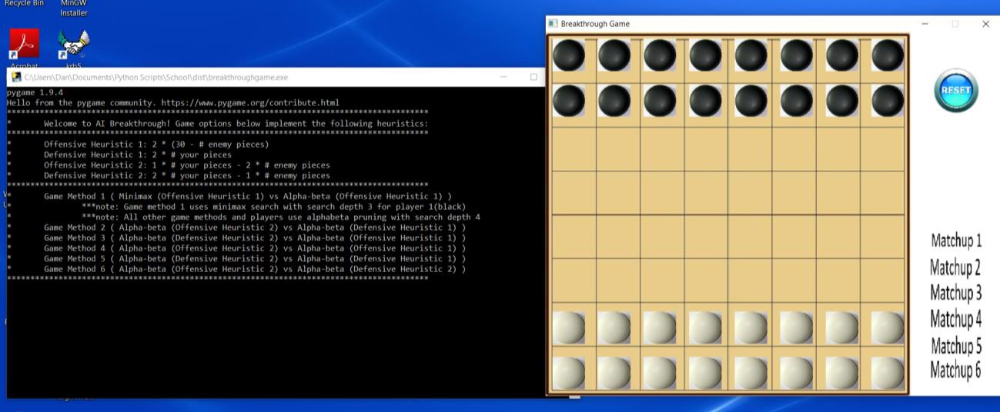
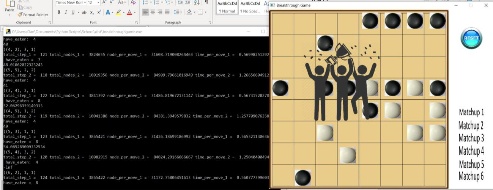

# Artificial Intelligence project: Breakthrough game!

This project was designed for a school assignment to create intelligent agents that operated in the environment known 
as the "Breakthrough" game, which you can read about here: https://en.wikipedia.org/wiki/Breakthrough_(board_game)

The goal of this project is to test out different search algorithms (minimax, alpha-beta pruning) and design evaluation 
functions that would optimize the agent behavior in particular ways.

## Evaluation Functions

The evaluation functions are used to return a value for a position when the depth limit of the search is reached. 
Try to determine the maximum depth to which it is feasible for you to do the search (for alpha-beta pruning, this 
depth should be larger than for minimax). The worst-case number of leaf nodes for a tree with a depth of three in this 
game is roughly 110,592, but in practice is usually between 25,000 - 35,000. Thus, you should at least be able to do 
minimax search to a depth of three.

Evaluation functions:
• def offensive_function(self, turn): 2*(30-self.enemyscore(turn))+random.random()/10
• def defensive_function(self, turn): 2*self.myscore(turn)+random.random()/10
• def offensive_function_2(self, turn): 1 * self.myscore(turn) - 2 * self.enemyscore(turn)
• def defensive_function_2(self, turn): 2 * self.myscore(turn) - 1 * self.enemyscore(turn)

## Required modules

pygame.  Pretty simple!

## Screen shots

### Contact information

Dan McGonigle
dpmcgonigle@gmail.com
